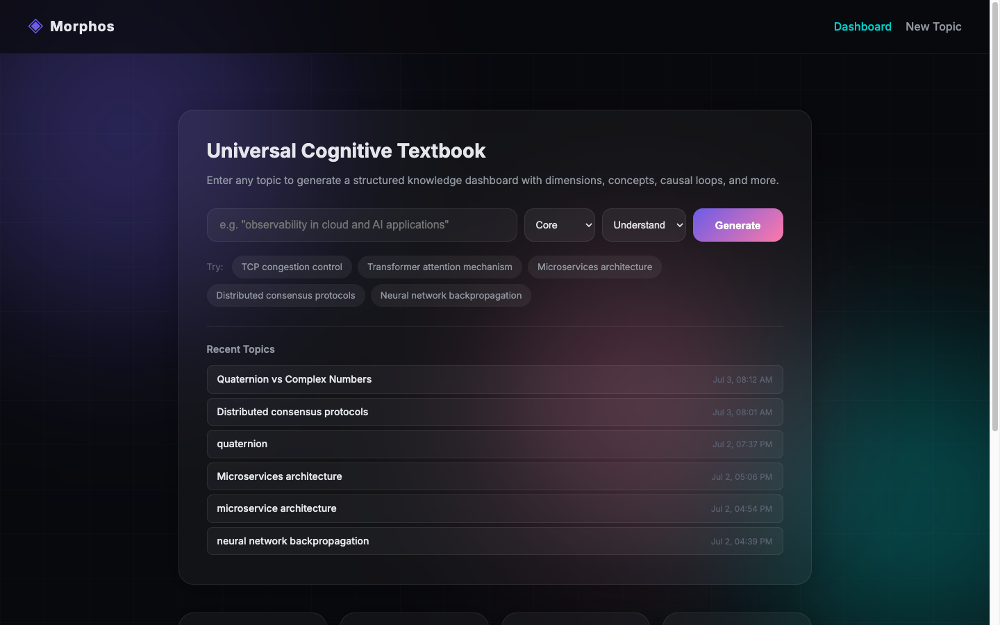
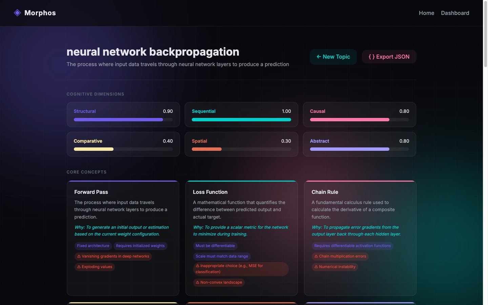
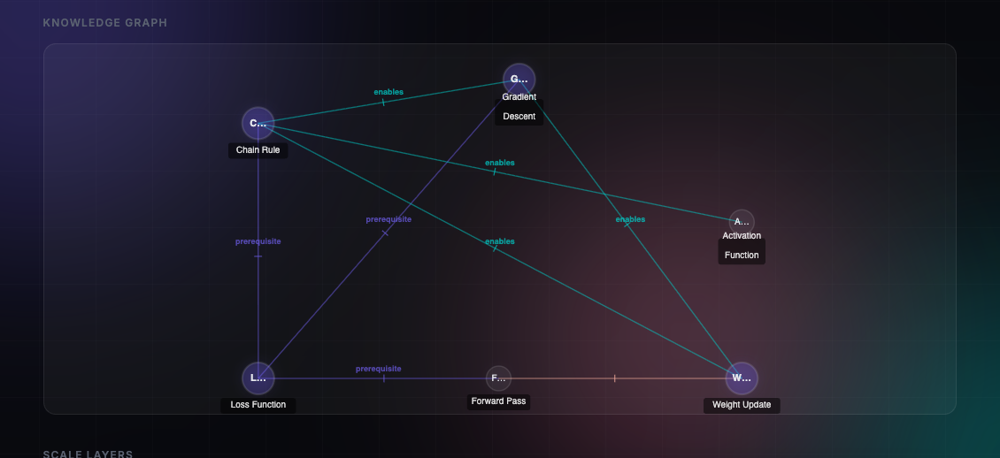
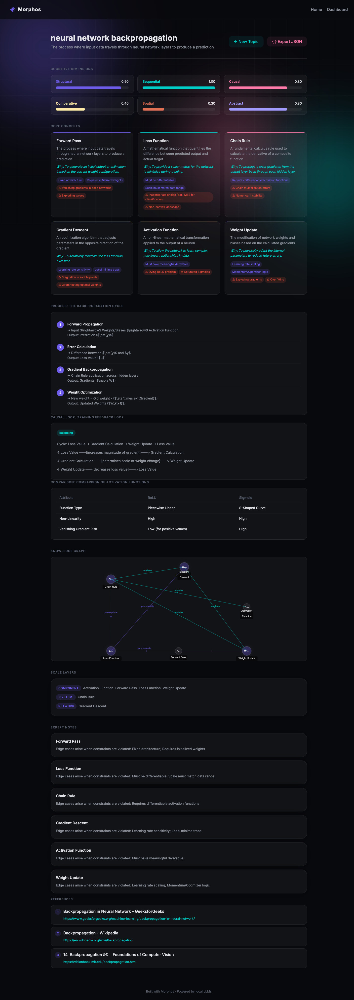
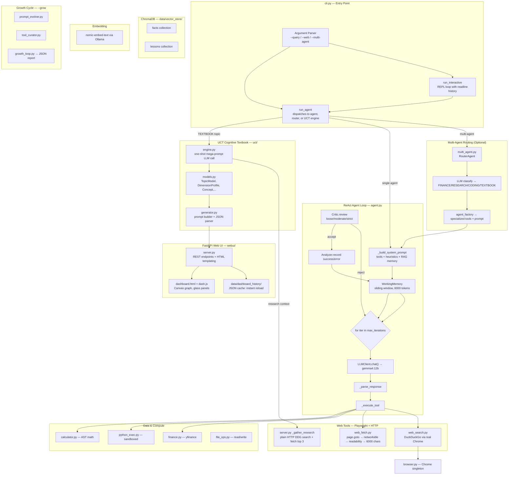

# Morphos — Autonomous AI Agent & Cognitive Textbook System

A fully autonomous, locally-run AI agent capable of web research, code execution, financial analysis, self-criticism, and a **Universal Cognitive Textbook (UCT)** engine that transforms any topic into an interactive knowledge dashboard. No cloud APIs. Everything runs on your machine.



```
┌─────────── Query ─────────────▶ Multi-Agent Router (optional)
│                                      ├─ FINANCE agent
│                                      ├─ RESEARCH agent  ◀── default
│                                      ├─ CODING agent
│                                      └─ TEXTBOOK agent  ← UCT web dashboard
│
▼         ▼ ReAct Loop            ▼ Tools executed
┌─── User    │ Thought → Action → Observe     │ web_search / web_fetch (Playwright Chrome)
│  Query     │ up to max-iters cycles          │ finance (yfinance) / python_exec
│ └──────────┼───────────────────────────────▶ │ calculator / memory_search
│            │                                 └──────────────┬──────────▼
│            │  Critic validates → accept/retry               ▼
│            │  Final Answer rendered                 Working Memory (6k tokens)
│            │                                         ↓
│            └─ on quit: Reflector ◀──▶ ChromaDB   (facts + lessons)
```

## Web UI — Cognitive Textbook Dashboard

```bash
python -m morphos.cli --web    # launches at http://localhost:8000
```



### Features

| Feature | Description |
|---------|-------------|
| **Topic Search** | Enter any subject, select depth (Essence → Expert) and mode (Understand, Exam, Practice, Research, Overview) |
| **Persistent History** | Every generated dashboard is saved to disk. Recent topics appear on the landing page — click to reload instantly without regeneration |
| **Cache-first loading** | Revisiting a topic loads from `data/dashboard_history/` in <100ms instead of spending 60+ seconds on LLM generation |

### Cognitive Regions

The dashboard renders six cognitive panels:



| Region | Content |
|--------|---------|
| **Dimensions** | Animated bars showing structural, sequential, causal, comparative, spatial, and abstract weightings for the topic |
| **Core Concepts** | Cards with definition, "why it exists", constraints chips, and failure-mode warnings |
| **Sequence Blocks** | Step-by-step process flows: inputs → transformations → validations → outputs per step |
| **Causal Loops** | Reinforcing and balancing cycle diagrams with typed node links |
| **Comparison Matrices** | Multi-axis tables comparing options across attributes |
| **Knowledge Graph** | Interactive Canvas-based force-directed graph — hover nodes to see connection details, edge types colored by relation |

### Full Dashboard Scroll



## Quick Start

### 1. Prerequisites

- **Python 3.10+**
- **[Ollama](https://ollama.com)** running locally with models pulled:

```bash
ollama pull gemma4:12b
ollama pull nomic-embed-text
```

- **Google Chrome** installed (used by Playwright for authentic web browsing)

### 2. Install

```bash
pip install ollama httpx beautifulsoup4 readability-lxml rich playwright \
            chromadb yfinance fastapi uvicorn
playwright install   # downloads browser binaries if needed
```

### 3. Run

| Mode | Command | Description |
|------|---------|-------------|
| Interactive REPL | `python -m morphos.cli` | Full session with persistent memory, reflection on exit |
| Single query | `python -m morphos.cli --query "..."` | One-shot answer, exits immediately |
| **Web UI (UCT)** | `python -m morphos.cli --web` | Browser at `localhost:8000` — interactive topic dashboards |
| Multi-agent routing | `python -m morphos.cli --multi-agent --query "..."` | Classifies query into FINANCE/RESEARCH/CODING before execution |
| Growth cycle | `python -m morphos.cli --grow` | Self-improvement: analyze past sessions, evolve prompts |

### CLI Options

| Flag | Default | Description |
|------|---------|-------------|
| `--query`, `-q` | — | Single query to run and exit |
| `--model` | `gemma4:12b` | Ollama model name |
| `--max-iters` | `10` | Maximum ReAct loop iterations per query |
| `--no-critic` | off | Disable critic validation layer |
| `--critic-strictness` | `moderate` | Critic level: `loose`, `moderate`, or `strict` |
| `--multi-agent` | off | Enable routing to specialized sub-agents |
| `--web` | off | Launch FastAPI web UI on port 8000 |
| `--port` | `8000` | Web UI server port |

## Architecture Overview



## Features

### Web Research (Playwright Chrome)
Uses real Google Chrome via Playwright to browse the web genuinely. DuckDuckGo search types queries like a human — no bot detection, no CAPTCHAs. Pages extracted with Mozilla's Readability + BeautifulSoup fallback for JS-heavy SPAs. The UCT engine also has a dedicated plain-HTTP research path (`_gather_research`) that searches DDG and fetches the top 3 results for context.

### Real-Time Financial Data
Direct stock/ETF/crypto pricing via **yfinance** — works from IPs that block Google Search, DDGS library, and Yahoo Finance web scraping.

### Persistent Memory (ChromaDB + Ollama Embeddings)
Cross-session memory with `nomic-embed-text` embeddings:
- **Facts** — verifiable statements extracted during session reflection
- **Lessons** — tool patterns, what worked and what didn't

Memory retrieved via semantic similarity each turn, injected into the system prompt.

### 🌱 Universal Cognitive Textbook (UCT)
Any topic → structured knowledge dashboard:

1. **Web research phase** — searches DDG, fetches top-3 pages for context
2. **One-shot LLM generation** — produces dimensions, concepts, sequence blocks, causal loops, comparison matrices, typed edges (~60s for full mode)
3. **Cache to disk** — saved as JSON in `data/dashboard_history/`
4. **Render** — dark-themed glassmorphism UI with animated dimension bars, concept cards, and a force-directed Canvas knowledge graph

Revisiting a cached topic loads instantly (<100ms).

### Self-Criticism & Quality Gates
A separate LLM pass validates every tool result before returning it. Three strictness levels (`loose` / `moderate` / `strict`). Rejected outputs trigger automatic retry with guidance.

### Multi-Agent Routing
Optional query classification dispatches to specialized sub-agents:

| Domain | Agent | Tools |
|--------|-------|-------|
| FINANCE | finance_agent | finance, web_fetch, web_search, calculator |
| RESEARCH | research_agent | web_search, web_fetch, memory_search, python_exec |
| CODING | coding_agent | python_exec, file_read, directory_search |
| **TEXTBOOK** | UCT engine | web research + one-shot LLM → dashboard HTML |

### Autonomous Growth Cycle
`--grow` analyzes session logs to improve the system — prompt evolution and tool curation with JSON diff reports.

## Tool Reference

| Tool | Module | Description | Parameters |
|------|--------|-------------|------------|
| `web_search` | `tools/web_search.py` | DDG via real Chrome, heuristic reranking | `query` |
| `web_fetch` | `tools/web_fetch.py` | Full page render + readability (6K chars) | `url` |
| `finance` | `tools/finance.py` | yfinance: price, volume, market data | `symbol` or `text_query` |
| `python_exec` | `tools/python_exec.py` | Sandboxed Python, 30s timeout | `code` |
| `calculator` | `tools/calculator.py` | AST-safe arithmetic | `expression` |
| `memory_search` | `tools/memory_search.py` | Semantic search of ChromaDB facts | `query` |
| `file_read` / `file_write` | `tools/file_ops.py` | Path-whitelisted file I/O | `filepath`, `content` |
| `directory_search` | `tools/directory_search.py` | Glob pattern discovery | `pattern` |

## Project Structure

```
morphos/
├── agent.py                # ReAct loop (Thought → Action → Observation)
├── cli.py                  # Rich terminal interface, --web web launcher
├── config.py               # Configuration dataclass
├── critic.py               # Output quality validation (3 levels)
├── analyzer.py             # Performance metrics per tool call
├── heuristics.py           # Learned source → URL pattern matching
├── multi_agent.py          # RouterAgent: classify + dispatch sub-agents
├── dynamic_tools.py        # Runtime-created tool persistence
├── llm.py                  # Ollama chat client wrapper
│
├── tools/                  # All agent capabilities
│   ├── browser.py          # Playwright singleton, real Chrome
│   ├── web_search.py       # DuckDuckGo automation
│   ├── web_fetch.py        # Readability extraction
│   ├── finance.py          # yfinance pricing
│   ├── python_exec.py      # Sandboxed code
│   ├── calculator.py       # AST-safe math
│   ├── memory_search.py    # ChromaDB tool
│   └── registry.py         # Pluggable tool system
│
├── memory/                 # Persistent knowledge
│   ├── chroma_store.py     # ChromaDB vectors + Ollama embedder
│   ├── working_memory.py   # Token-aware sliding window
│   └── reflector.py        # Post-session fact/lesson extraction
│
└── self_improve/           # Autonomous growth
    ├── prompt_evolver.py
    ├── tool_curator.py
    └── growth_loop.py

uct/                        # Universal Cognitive Textbook engine
├── engine.py               # Orchestrates research → generation → render
├── models.py               # TopicModel, DimensionProfile, Concept, etc.
├── generator.py            # One-shot mega-prompt builder + JSON parser
├── renderer.py             # Rich terminal dashboard rendering
├── dimensions.py           # Cognitive dimension analysis prompts
├── graph.py                # Knowledge graph with typed edges
├── toolkit.py              # UCT-specific tools for the agent
├── compressor.py           # Summary at multiple expert levels
└── prompts.py              # Structured generation prompts

webui/                      # FastAPI web interface
├── server.py               # REST endpoints, cache I/O, research pipeline
│                           # GET /api/history, POST /api/dashboard, etc.
├── static/
│   ├── index.html          # Landing page with search + recent topics
│   ├── dashboard.html      # Full dashboard template (glassmorphism)
│   ├── styles.css          # CSS variables, animations, responsive layout
│   └── dash.js             # Client-side rendering: bars, cards, canvas graph

data/
├── vector_store/           # ChromaDB persistent database
├── dashboard_history/      # Cached UCT topic models (JSON)
├── search_heuristics.json  # Learned source preferences
└── logs/                   # Analyzer session history
```

## Development Stack

| Layer | Technology |
|-------|-----------|
| LLM inference | [Ollama](https://ollama.com) + `gemma4:12b` |
| Embeddings | Ollama + `nomic-embed-text` (768-dim vectors) |
| Web automation | [Playwright](https://playwright.dev) + real Google Chrome |
| Vector DB | [ChromaDB](https://www.trychroma.com/) persistent client |
| Terminal UI | [Rich](https://rich.readthedocs.io/) — panels, highlighting |
| Web UI | [FastAPI](https://fastapi.tiangolo.com/) + [Uvicorn] |
| Content extraction | Readability.js (Python port) + BeautifulSoup |
| Financial data | [yfinance](https://github.com/ranaroussi/yfinance) |

### Built With
This project was developed entirely with **[opencode](https://github.com/opencode-ai/opencode)** using **[qwen3.6:27b](https://ollama.com/library/qwen3)** running locally via Ollama. Every line of code, architecture decision, test run, and iteration flowed through opencode — making Morphos a real-world example of agentic development.
