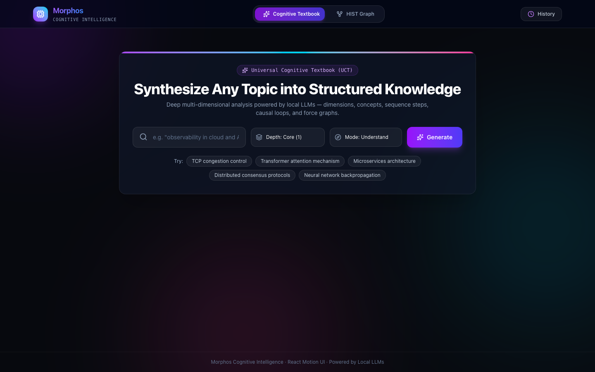
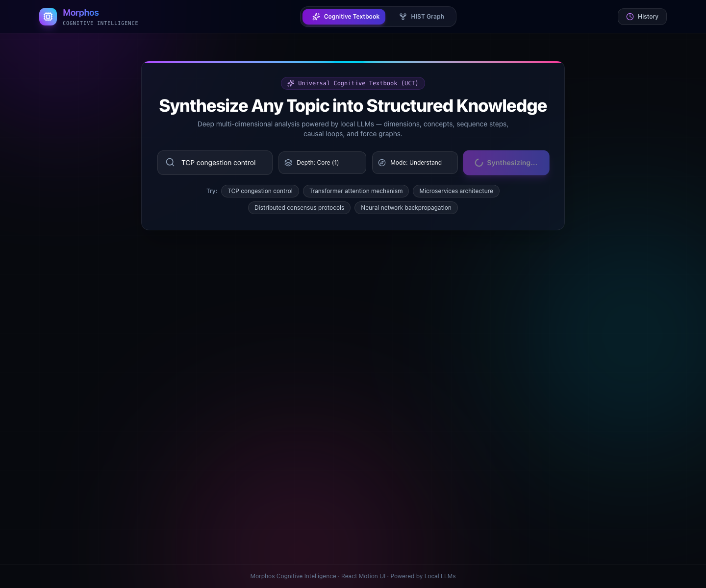
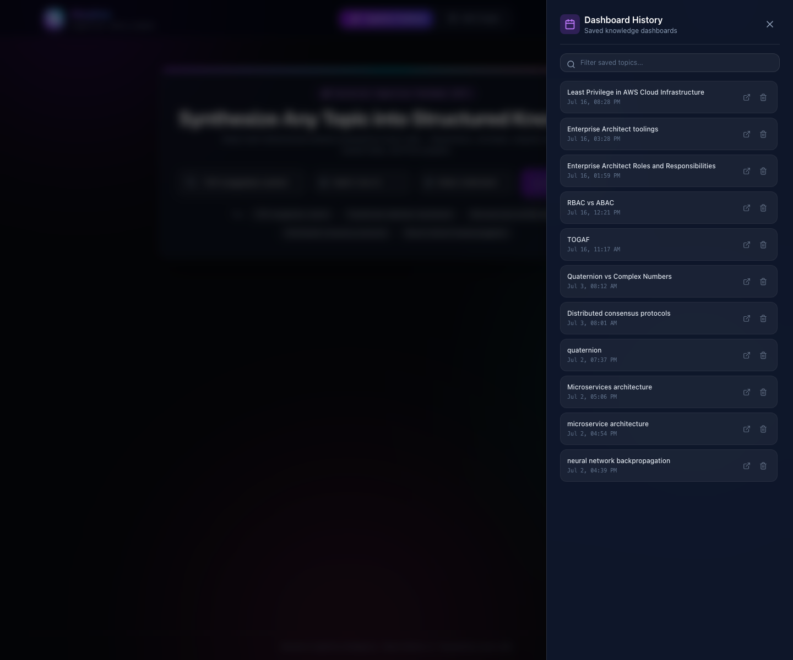
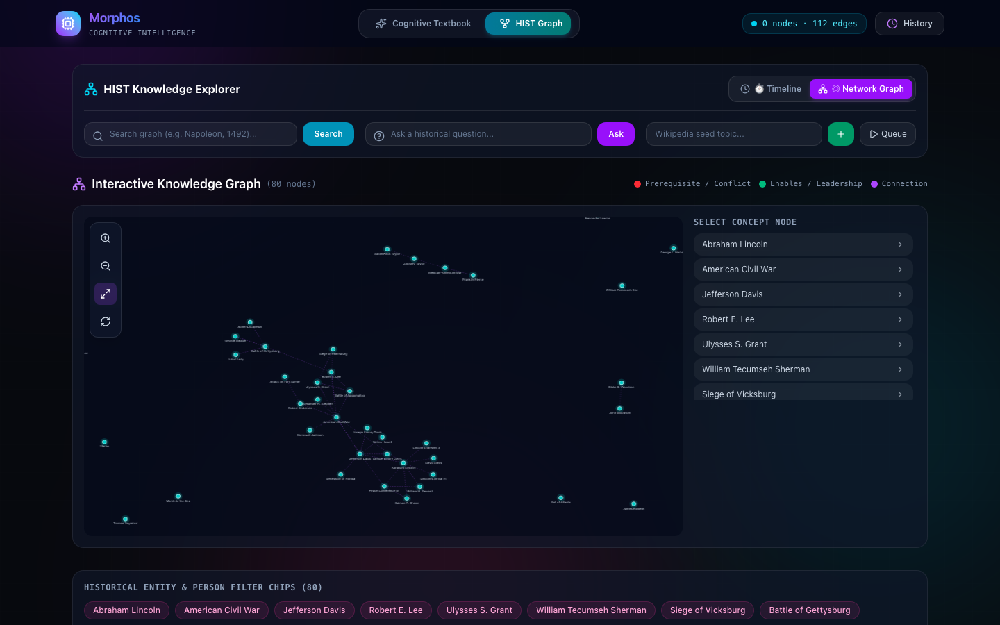
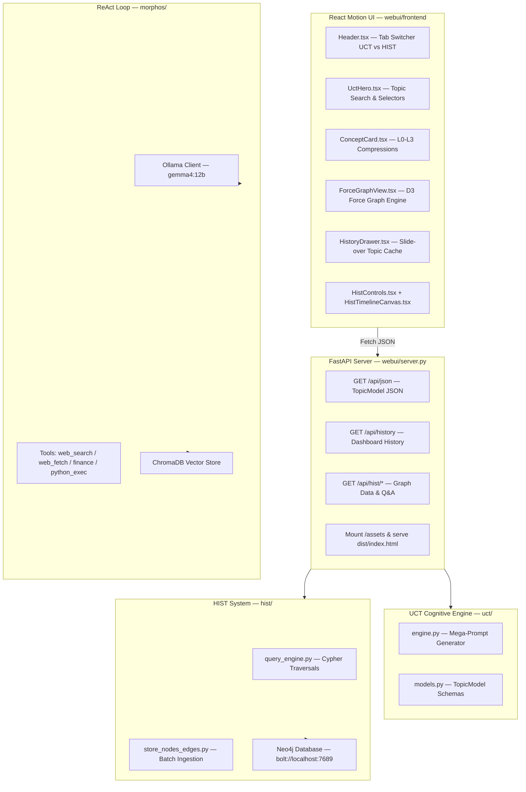

# Morphos — Autonomous AI Agent, Cognitive Textbook & HIST Graph System

A fully autonomous, locally-run AI agent capable of web research, code execution, financial analysis, self-criticism, a **Universal Cognitive Textbook (UCT)** engine, and a **HIST Knowledge Graph & Timeline Engine**. Built with a modern **React Motion UI** powered by React 19, Vite, Framer Motion, Tailwind CSS, Lucide icons, and D3 force graph visualizers. No cloud APIs. Everything runs locally on your machine.



```
┌─────────── Query ─────────────▶ Multi-Agent Router (optional)
│                                      ├─ FINANCE agent
│                                      ├─ RESEARCH agent  ◀── default
│                                      ├─ CODING agent
│                                      ├─ TEXTBOOK agent  ← UCT web dashboard
│                                      └─ HIST agent      ← History Graph & Timeline
│
▼         ▼ ReAct Loop            ▼ Tools executed
┌─── User    │ Thought → Action → Observe     │ web_search / web_fetch (Playwright Chrome)
│  Query     │ up to max-iters cycles          │ finance (yfinance) / python_exec
│ └──────────┼───────────────────────────────▶ │ calculator / memory_search
│            │                                 └──────────────┬──────────▼
│            │  Critic validates → accept/retry               ▼
│            │  Final Answer rendered                 Working Memory (6k tokens)
│            │                                         ↓
│            └─ on quit: Reflector ◀──▶ ChromaDB   (facts + lessons)
```

---

## ⚡ React Motion Web UI

Launch the modern Single Page Application (SPA) at `http://localhost:8000`:

```bash
python -m uvicorn webui.server:app --reload
```

### 1. Cognitive Textbook Dashboard
Synthesizes any topic into an interactive multi-dimensional dashboard with animated dimension bars, concept cards (L0-L3 level compressions), execution sequences, causal loops, and D3 force graphs:



### 2. Persistent Topic History Drawer
Slide-over drawer providing instant access (<100ms load from disk cache) to all previously generated topic dashboards, with topic filtering and deletion:



### 3. HIST Knowledge Network Graph
Neo4j-backed factual history graph with interactive D3 force-directed node physics, zoom/pan controls, timeline scrubber, and Cypher Q&A engine:



---

## 🧠 Dual-Engine Capabilities

### 1. Universal Cognitive Textbook (UCT)
Synthesizes any topic into a structured multi-dimensional knowledge dashboard:

| Panel | Description |
|---|---|
| **Cognitive Dimensions** | Animated bars showing structural, sequential, causal, comparative, spatial, and abstract weightings |
| **Core Concepts** | Interactive cards with definition, "why it exists", constraints, failure modes, and progressive L0 (Essence) → L3 (Expert) level compressions |
| **Execution Sequences** | Step-by-step process flows: inputs → transformations → validations → outputs per stage |
| **Causal Loops** | Reinforcing and balancing system dynamic cycle diagrams |
| **Comparison Matrices** | Multi-axis comparison tables across attributes and options |
| **Knowledge Graph** | Interactive D3 force-directed concept graph with connection inspector |
| **Persistent History** | Slide-over drawer listing past topics with instant load (<100ms) and deletion |

### 2. HIST History Knowledge Graph & Timeline
Neo4j-backed factual knowledge graph of historical events, figures, and relationships:

| Feature | Description |
|---|---|
| **Interactive D3 Force Graph** | Force-directed view of historical nodes (*Abraham Lincoln*, *Civil War*, *Gettysburg*, *Grant*, *Lee*) and typed relationship edges |
| **Chronological Timeline** | Interactive timeline scrubber with date markers |
| **Graph Q&A Engine** | Factual history Q&A powered by Cypher traversals and evidence list drawer |
| **Wikipedia Ingest Queue** | Organic graph growth by seeding Wikipedia pages and processing queued URLs |

---

## 🚀 Quick Start

### 1. Prerequisites

- **Python 3.10+** & **Node.js 18+**
- **[Ollama](https://ollama.com)** running locally with required models:

```bash
ollama pull gemma4:12b
ollama pull nomic-embed-text
```

- **Google Chrome** installed (used by Playwright for authentic web browsing)
- **Neo4j** (optional for HIST Graph storage):
  ```bash
  docker run -d -p 7689:7687 -p 7474:7474 -e NEO4J_AUTH=neo4j/morphos_hist neo4j:latest
  ```

### 2. Installation

```bash
pip install -e .
playwright install   # downloads browser binaries if needed
```

To build or modify the React Motion UI frontend:
```bash
cd webui/frontend
npm install
npm run build
```

### 3. Running Morphos

| Mode | Command | Description |
|------|---------|-------------|
| **React Motion Web UI** | `python -m uvicorn webui.server:app --reload` | Browser at `localhost:8000` — unified UCT & HIST SPA |
| Interactive CLI | `python -m morphos.cli` | REPL session with persistent memory and reflection on exit |
| Single query | `python -m morphos.cli --query "..."` | One-shot answer, exits immediately |
| Multi-agent routing | `python -m morphos.cli --multi-agent --query "..."` | Classifies query into FINANCE/RESEARCH/CODING before execution |
| Growth cycle | `python -m morphos.cli --grow` | Self-improvement loop: analyze past sessions & evolve prompts |

---

## 🏗 Architecture Overview



---

## 🛠 Tool Reference

| Tool | Module | Description | Parameters |
|------|--------|-------------|------------|
| `web_search` | `tools/web_search.py` | DDG via real Chrome, heuristic reranking | `query` |
| `web_fetch` | `tools/web_fetch.py` | Full page render + readability (6K chars) | `url` |
| `finance` | `tools/finance.py` | yfinance: price, volume, market data | `symbol` or `text_query` |
| `python_exec` | `tools/python_exec.py` | Sandboxed Python execution | `code` |
| `calculator` | `tools/calculator.py` | AST-safe arithmetic | `expression` |
| `memory_search` | `tools/memory_search.py` | Semantic search of ChromaDB facts | `query` |
| `file_read` / `file_write` | `tools/file_ops.py` | Path-whitelisted file I/O | `filepath`, `content` |
| `directory_search` | `tools/directory_search.py` | Glob pattern discovery | `pattern` |

---

## 📂 Project Structure

```
morphos/                    # ReAct agent core loop & tools
├── agent.py                # ReAct loop (Thought → Action → Observation)
├── cli.py                  # Rich terminal REPL interface
├── config.py               # Config dataclass
├── critic.py               # Output quality validation (3 strictness levels)
├── multi_agent.py          # RouterAgent: classify + dispatch sub-agents
├── llm.py                  # Ollama chat client wrapper
└── tools/                  # Pluggable tool registry

webui/                      # Web application host
├── server.py               # FastAPI REST endpoints & SPA host
├── hist_app.py             # FastAPI routes for HIST graph & Q&A
├── frontend/               # Modern React Motion UI (React 19 + Vite + Tailwind + Framer Motion)
│   ├── index.html          # HTML entry point with Google Fonts
│   ├── vite.config.ts      # Vite config with API proxy
│   ├── src/
│   │   ├── App.tsx         # Master layout orchestrator
│   │   ├── components/     # UCT, HIST, and Common Motion components
│   │   └── services/api.ts # REST API client
│   └── dist/               # Built static bundle
└── static/                 # Legacy HTML/CSS fallback templates

hist/                       # HIST Knowledge Graph & Timeline engine
├── config.py               # Neo4j connection configuration (.env aware)
├── query_engine.py         # Cypher query templates & graph traversal
├── orchestrator.py         # Page ingestion pipeline
├── neo4j_driver/           # Neo4j driver connection manager
└── storage/                # Node and relationship persistence

uct/                        # Universal Cognitive Textbook engine
├── engine.py               # Research → generation → model pipeline
├── models.py               # TopicModel, DimensionProfile, Concept schemas
└── generator.py            # Mega-prompt builder + JSON parser
```

---

## 💻 Tech Stack & License

| Layer | Technology |
|---|---|
| **LLM Inference** | [Ollama](https://ollama.com) + `gemma4:12b` |
| **Embeddings** | Ollama + `nomic-embed-text` (768-dim vectors) |
| **Web UI Framework** | React 19 + Vite + TypeScript |
| **UI Motion & Styling** | Framer Motion + Tailwind CSS + Lucide Icons |
| **Graph Visualization** | D3-force (`d3-force`) + HTML5 Canvas & SVG |
| **Graph Database** | Neo4j (`neo4j` Python driver) |
| **Vector DB** | [ChromaDB](https://www.trychroma.com/) persistent store |
| **Backend Server** | [FastAPI](https://fastapi.tiangolo.com/) + Uvicorn |
| **Automation** | [Playwright](https://playwright.dev) + real Google Chrome |
