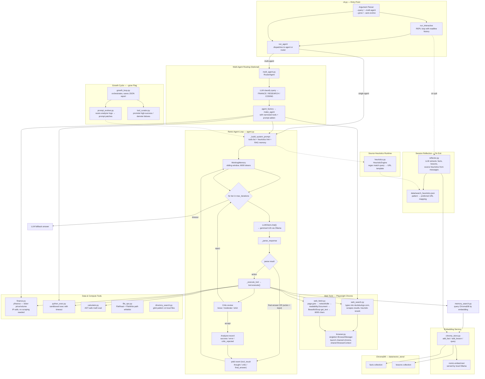

# Morphos Architecture & Workflow

## Component Details

| Component | File | Role |
|---|---|---|
| **LLM Inference** | `llm.py` | Wraps Ollama API, calls `gemma4:12b` for chat & classification |
| **Embedding** | `memory/chroma_store.py` | Calls `nomic-embed-text` via same local Ollama instance |
| **ReAct Loop** | `agent.py` | Thought → Action → Observation cycle, max 10 iterations |
| **Working Memory** | `memory/working_memory.py` | Token-aware sliding window (6000 tokens), keeps system prompt |
| **Persistent Memory** | `memory/chroma_store.py` | ChromaDB vector store with two collections: facts & lessons |
| **Critic** | `critic.py` | Post-tool LLM validation — loose/moderate/strict |
| **Analyzer** | `analyzer.py` | Records per-tool metrics (duration, status, critic verdict) |
| **Browser** | `tools/browser.py` | Singleton Playwright manager, real Chrome channel |
| **Web Search** | `tools/web_search.py` | Types into duckduckgo.com in real Chrome, heuristic rerank |
| **Web Fetch** | `tools/web_fetch.py` | Playwright page → readability extraction → 6000 chars text |
| **Finance** | `tools/finance.py` | yfinance library — bypasses IP-blocked Yahoo scraping |
| **Memory Search** | `tools/memory_search.py` | Embeds query, searches ChromaDB collections by similarity |
| **Heuristics** | `heuristics.py` | Runtime regex match of query → preferred URL templates |
| **Reflector** | `memory/reflector.py` | End-of-session LLM pass extracting facts, lessons, heuristics |
| **Router Agent** | `multi_agent.py` | LLM classifies queries into FINANCE/RESEARCH/CODING sub-agents |
| **Growth Loop** | `self_improve/growth_loop.py` | Orchestrates prompt evolution + tool curation on `--grow` |

## Workflow Summary

### Single Query
1. CLI parses args, calls `run_agent(query)`
2. If `--multi-agent`, RouterAgent classifies query with LLM, dispatches to narrow sub-agent
3. Agent builds system prompt: tool list + RAG memory recall + heuristic hints
4. ReAct loop fires: LLM generates Thought/Action → tool executes → Critic validates → result into Working Memory
5. On `Final Answer` or timeout (`--max-iters`), agent yields answer with fallback prompt
6. Events stream to Rich CLI as panels (thoughts, tool results, critic verdicts, final answer)

### Session Exit
1. All accumulated messages sent to Reflector LLM pass
2. Extracted facts stored as vectors in ChromaDB (via `nomic-embed-text` embedding)
3. Source heuristics learned → merged into `data/search_heuristics.json`
4. Analyzer session log saved, optional dynamic tool persistence prompt

### Growth Cycle (`--grow`)
1. Scans analyzer logs for failure patterns
2. Prompt Evolver proposes system prompt patches via LLM
3. Tool Curator promotes high-success dynamic tools, demotes chronic failures
4. Report saved to `data/growth_report_<timestamp>.json`
